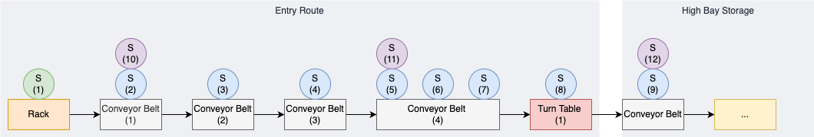

# Jacob & Loïc

## File Structure

io_extension.py -> kopiert von altem Projekt

mqtt_subscriber.py -> kopiert von altem Projekt

## RaspberryPi
|          |       |   |
| -------- | ----- | - |
| Username | ***** |   | 
| Password | ***** |   |


## Operators

Es gibt 3x Arten von Operatoren:
1. [Conveyor Belt Operator](./src/operators/conveyor_belt_operator.py)
2. [Turn Table Operator](./src/operators/turn_table_operator.py)
3. [Sensor Operator](./src/operators/sensor_operator.py)

Ein Operator definiert nur die Grundfunktionen, nicht aber das Objekt an sich. Dafür muss ein Operator mit den richtigen Ports definiert werden.

```Python
cb1 = ConveyorBeltOperator(io, "short", 2)
cb2 = ConveyorBeltOperator(io, "short", 3)
```

## Controller

Es gibt einen [Entry Route](./src/entry_route.py) Controller. Dieser steuert die [Operatoren](#operators) und beinhaltet die grundlegende Logik.

```Python
entryRoute = EntryRoute(io, operators)
entryRoute.moveBox()
```

## Plan
